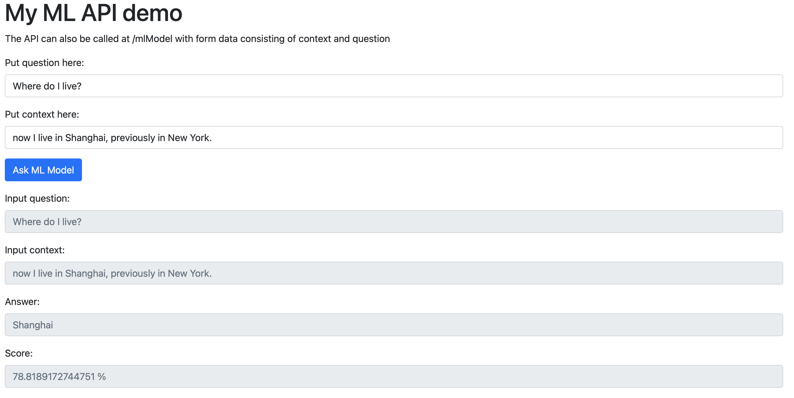

# ML-API-Demo
This is an Demo App using [flask](https://flask.palletsprojects.com/en/2.0.x/) to serve an [HugginFace](https://huggingface.co) model. The current model is a question answering model. Ask it a question (with some context) and get an answer :D


## Demo
Click [here](https://ds20m007-mlapi.azurewebsites.net) for a demo.

## Installation

```bash
docker pull ds20m007/ml-api-demo
```

## Usage 
To start the docker container run:
```bash
docker run -p 80:5000 ds20m007/ml-api-demo
```
You can change the port 80 to whatever you want.
Note: Https is not supported

## API
It has to endpoints configured in Flask:
- **/** to serve an Webpage (see Screenshot)
- **/mlModel** which takes a question and context as form data and returns the answer and the score

## Contributing
This was done for a class project, so contributing won't be possible.

## License
[MIT](https://choosealicense.com/licenses/mit/)